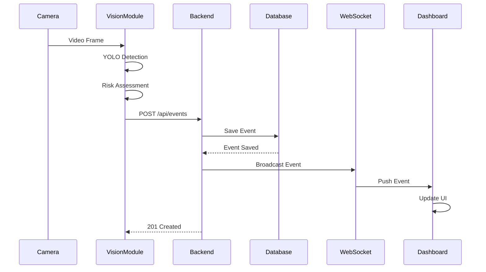
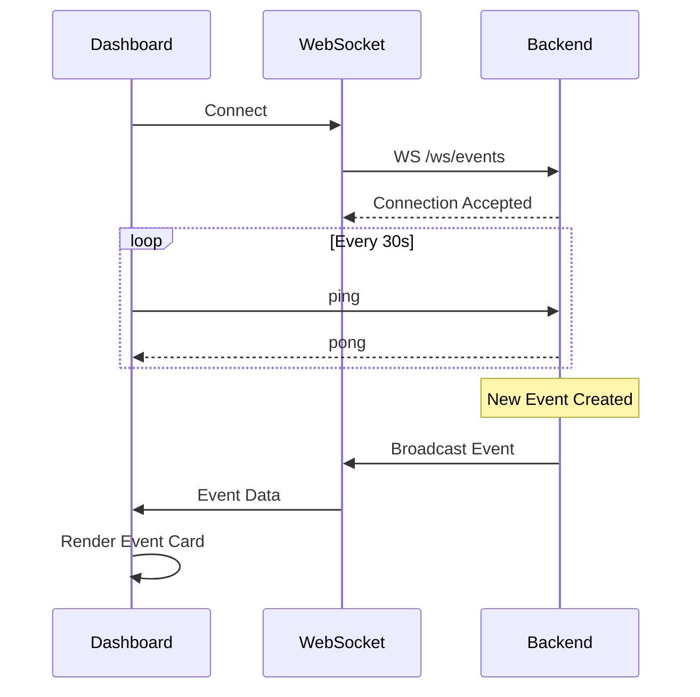

# SafeLift-AI System Architecture

## Overview

SafeLift-AI is a comprehensive real-time safety monitoring system designed to detect and prevent forklift-related accidents in industrial environments. The system uses computer vision (YOLO), a FastAPI backend, and a React dashboard to provide end-to-end safety monitoring.

## System Components

### 1. Vision Module (Python + YOLO)

**Purpose**: Real-time object detection and risk assessment from camera feeds

**Technology Stack**:
- **YOLOv8/v11** (Ultralytics) for object detection
- **OpenCV** for camera capture and frame processing
- **NumPy** for numerical operations

**Key Features**:
- Real-time person and forklift detection
- Distance-based risk calculation
- Automatic event generation for safety violations
- Visual feedback with bounding boxes

**Main Components**:
- `detector.py`: YOLO model wrapper with detection and risk assessment logic
- `capture.py`: Webcam capture loop with event posting to backend
- `config.py`: Configuration settings (camera index, thresholds, backend URL)

**Detection Flow**:
```
Camera Feed → Frame Capture → YOLO Detection → Risk Assessment → Event Generation → POST to Backend
```

**Risk Calculation**:
- Detects both people and forklifts in frame
- Calculates pixel-based distance between detected objects
- Assigns severity (1-5) based on proximity:
  - < 100 pixels: Critical (5)
  - < 150 pixels: High (4)
  - < 200 pixels: Moderate (3)

---

### 2. Backend (FastAPI + PostgreSQL)

**Purpose**: Central API server for event management and real-time communication

**Technology Stack**:
- **FastAPI** for REST API
- **SQLAlchemy** ORM for database operations
- **PostgreSQL** for persistent storage
- **WebSockets** for real-time event broadcasting

**Key Features**:
- RESTful CRUD operations for events
- WebSocket support for real-time updates
- Automatic database table creation
- CORS-enabled for frontend integration

**Database Schema**:

**Events Table**:
| Column | Type | Description |
|--------|------|-------------|
| id | Integer (PK) | Unique event identifier |
| timestamp | DateTime | Event occurrence time |
| type | String | Event type classification |
| severity | Integer (1-5) | Risk level |
| source | String | Camera/sensor identifier |
| metadata | JSON | Additional event data |

**API Endpoints**:
- `GET /health`: Health check
- `GET /api/events`: List all events (with filters)
- `POST /api/events`: Create new event (triggers WebSocket broadcast)
- `GET /api/events/{id}`: Get specific event
- `WS /ws/events`: WebSocket endpoint for real-time event stream

**Event Flow**:
```
Vision Module POST → FastAPI validates → Save to PostgreSQL → Broadcast via WebSocket → Dashboard receives
```

---

### 3. Dashboard (React + Vite + Tailwind)

**Purpose**: Real-time visualization and historical analysis interface

**Technology Stack**:
- **React 18** for UI components
- **Vite** for fast development and building
- **TailwindCSS** for styling
- **React Router** for navigation
- **WebSocket API** for real-time updates

**Key Features**:
- Real-time event monitoring with WebSocket
- Historical event browsing with filtering
- Severity-based color coding
- Auto-reconnecting WebSocket client
- Responsive design

**Pages**:
1. **Live Events**: Real-time event stream with filtering by severity and type
2. **History**: Historical event viewer with pagination and filtering
3. **Settings**: Configuration for connection, display, and notifications

**Components**:
- `Sidebar`: Navigation menu
- `Topbar`: Connection status and clock
- `EventCard`: Event display with severity styling

**Utilities**:
- `ws.js`: WebSocket client with auto-reconnect
- `api.js`: REST API client wrapper

**Data Flow**:
```
WebSocket Connection → Event Received → State Update → UI Re-render
REST API Call → Fetch Events → Display in UI
```

---

## Communication Flow

### Event Creation Flow



### Real-time Monitoring Flow



---

## Deployment Architecture

### Development Setup

```
┌─────────────────┐       ┌──────────────────┐       ┌─────────────────┐
│  Vision Module  │       │   FastAPI Backend │       │ React Dashboard │
│  Python + YOLO  │──────▶│ PostgreSQL + WS   │◀──────│  Vite Dev Server│
│  Port: N/A      │  HTTP │  Port: 8000       │  WS   │  Port: 3000     │
└─────────────────┘       └──────────────────┘       └─────────────────┘
        │                          │
        │                          │
        ▼                          ▼
   Camera Feed              PostgreSQL DB
                            Port: 5432
```

### Production Considerations

1. **Vision Module**:
   - Run on edge devices near cameras
   - GPU acceleration for YOLO inference
   - Multiple instances for multiple cameras

2. **Backend**:
   - Deploy on cloud/on-premise server
   - Use production WSGI server (Gunicorn + Uvicorn)
   - Redis for WebSocket scaling (multiple workers)
   - Database connection pooling

3. **Dashboard**:
   - Build static files (`npm run build`)
   - Serve via Nginx/Apache
   - CDN for static assets

4. **Database**:
   - PostgreSQL with proper indexing
   - Regular backups
   - Partitioning for large datasets

---

## Security Considerations

1. **Authentication**: Add JWT-based authentication for API endpoints
2. **HTTPS/WSS**: Use encrypted connections in production
3. **API Rate Limiting**: Prevent abuse of event creation endpoint
4. **Database Security**: Use strong credentials, restrict network access
5. **Input Validation**: Validate all incoming event data

---

## Scalability

### Horizontal Scaling Options

1. **Vision Module**: Deploy multiple instances for different camera feeds
2. **Backend**: Load balance FastAPI instances behind Nginx
3. **WebSocket**: Use Redis pub/sub for multi-worker WebSocket support
4. **Database**: Read replicas for event queries

### Performance Optimization

1. **Vision Module**:
   - Adjust detection confidence threshold
   - Process every N frames instead of all frames
   - Use smaller YOLO models (yolov8n vs yolov8x)

2. **Backend**:
   - Database indexing on timestamp and severity
   - Event aggregation for reduced WebSocket traffic
   - Caching for frequently accessed data

3. **Dashboard**:
   - Virtual scrolling for large event lists
   - Lazy loading of historical data
   - Debounced filter updates

---

## Monitoring and Observability

### Key Metrics to Track

1. **Vision Module**:
   - Detection FPS
   - Event generation rate
   - API request success/failure rate

2. **Backend**:
   - Request latency
   - Active WebSocket connections
   - Database query performance
   - Event ingestion rate

3. **Dashboard**:
   - WebSocket connection stability
   - Page load times
   - User interaction patterns

### Logging Strategy

- **Vision Module**: Log detection results and API errors
- **Backend**: Structured logging with request IDs
- **Dashboard**: Client-side error tracking (Sentry, etc.)

---

## Technology Decisions

### Why YOLO?
- Real-time performance (30+ FPS)
- Pre-trained models for common objects (person, vehicle)
- Easy to fine-tune for custom objects (forklifts)
- Active community and regular updates

### Why FastAPI?
- High performance (async/await support)
- Built-in WebSocket support
- Automatic OpenAPI documentation
- Type safety with Pydantic

### Why React + Vite?
- Fast development with hot module replacement
- Modern tooling and ecosystem
- Component reusability
- Excellent performance

### Why PostgreSQL?
- JSON support for flexible metadata
- Strong consistency guarantees
- Mature ecosystem
- Good performance for time-series data

---

## Future Enhancements

1. **ML Improvements**:
   - Fine-tune YOLO on forklift-specific dataset
   - Add pose estimation for worker positioning
   - Implement trajectory prediction

2. **Analytics**:
   - Event trending and patterns
   - Heatmaps of high-risk areas
   - Daily/weekly safety reports

3. **Integrations**:
   - Email/SMS alerts for critical events
   - Integration with existing safety systems
   - Export to BI tools (Tableau, Power BI)

4. **UI Enhancements**:
   - Video playback of events
   - Multi-camera view
   - Real-time dashboard widgets
   - Mobile app

---

## Conclusion

SafeLift-AI provides a complete, modern architecture for real-time safety monitoring. The modular design allows each component to be developed, tested, and scaled independently while maintaining clear communication channels through well-defined APIs.
